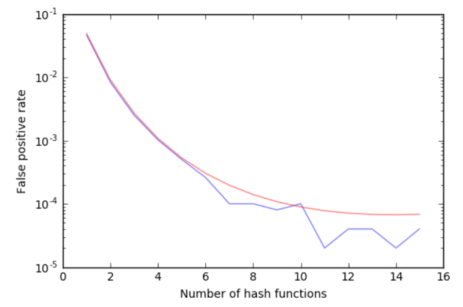

# Bloom-filter-report

- Implementation of a Bloom Filter using the mmh3 hash function
- The false positive ratio is given by using various numbers of hash functions are compared to the theoretical predictions

